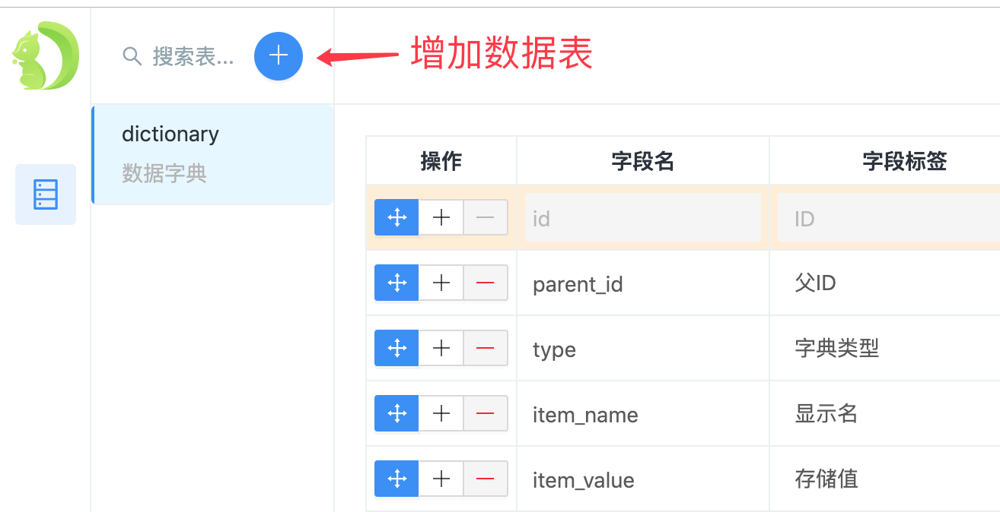
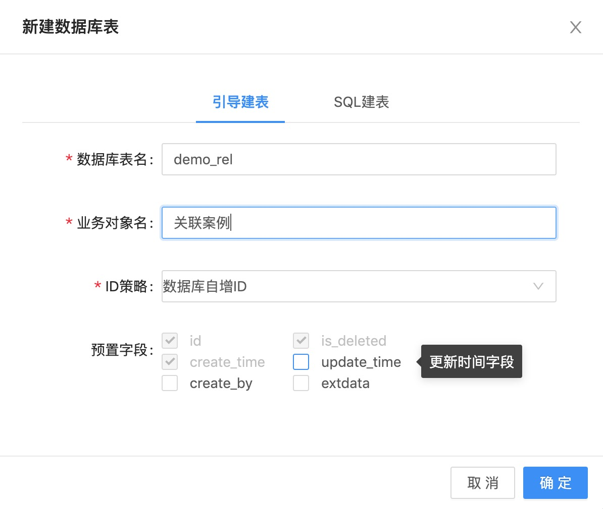
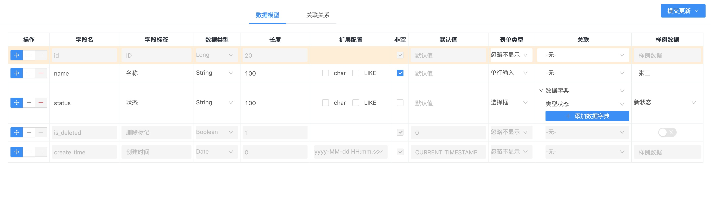

##后端
###第一步
1. 准备一个空数据库
###第二步
1. 修改配置文件`application-env`环境
2. 在rabbitmq中添加虚拟主机 `test` 或者 使用自带的主机 `/`
### 启动项目
点击 
```java
-- -- -- -- -- -- -- -- -- -- -- -- -- -- -- -- -- --
-- Diboot devtools v2.9.0 初始化完成: 
-> URL: http://localhost:8080/diboot/index.html
-- -- -- -- -- -- -- -- -- -- -- -- -- -- -- -- -- --
```
生成模板，点击一键生成





## Springboot整合WebSoket (stomp)

### 1. 配置类

```java
@Configuration
@EnableWebSocketMessageBroker
public class WebSocketConfig implements WebSocketMessageBrokerConfigurer{
    // 添加Endpoint，这样在网页中就可以通过websocket连接上服务,也就是我们配置websocket的服务地址,并且可以指定是否使用socketjs
    public void registerStompEndpoints(StompEndpointRegistry registry){
        registry.addEndpoint("/websocket")
                .setAllowedOrigins("http://localhost:8080")
                .withSockJS();
    }
    
    // 配置消息代理，哪种路径的消息会进行代理处理
    public void configureMessageBroker(MessageBrokerRegistry registry){
        // STOMP的Header字段destination中以/app前缀的会被转发到@MessageMapping中处理
        registry.setApplicationDestinationPrefixes("/app");
        // destination中以/topic,/queue前缀的，都会发送到队列中，等待消息消费
        registry.enableSimpleBroker("/topic", "/queue");
    }
}
```

### 2. 服务端消息处理器

- @MessageMapping注解，功能类似@RequestMapping，它是存在于Controller中的，定义一个消息的基本请求

```java
    /**
     * @param message :接收客户端传输的消息
     * @MessageMapping("sendAll"): 接收来自sendAll路径的消息
     * @SendTo("/topic/receive"): 将消息发送到 /topic/receive 路径的客户端
     */
    @MessageMapping("/hello")
    @SendTo("/topic/greetings")
    public String greeting(String message)  {
        return "Hello, " + message + "!";
    }
```

- SimpMessagingTemplate是Spring-WebSocket内置的一个消息发送工具，可以将消息发送到指定的客户端。

```java
    @MessageMapping("sendAll")
    public void sendAll(Message message){
        simpMessagingTemplate.convertAndSend("/topic/receive",message);
    }
```
## 使用rabbitmq
### 添加rabbitmq的延迟插件
```shell
#将安装包放到 安装目录的plugins下
wget https://github.com/rabbitmq/rabbitmq-delayed-message-exchange/releases/download/3.9.0/rabbitmq_delayed_message_exchange-3.9.0.ez
#执行命令
rabbitmq-plugins enable rabbitmq_delayed_message_exchange
```
1. 使用 DelayProduer 将消息发送到延迟队列，
2. 使用 DelayConsumer 接收处理消息